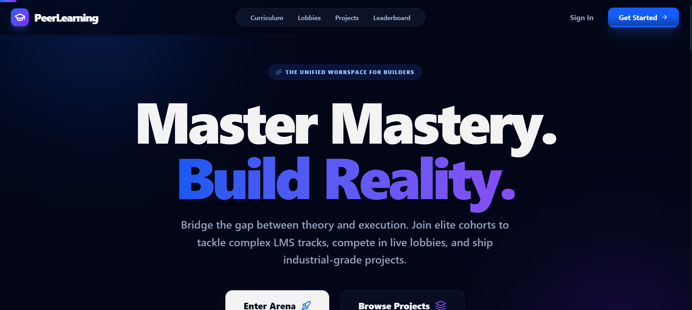
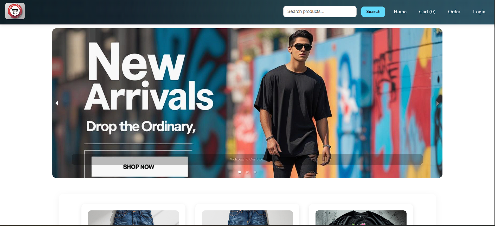

<h1 align="center">Hi 👋, I'm Aamir Hussain</h1>

<h3 align="center">
Full Stack & Backend Developer 🚀
</h3>

<p align="center">
Building scalable web applications, AI-powered tools, and modern backend systems.
</p>

<p align="center">
  
</p>

---

## 🌐 Connect With Me

<p align="center">
<a href="https://portfolio-aamir.vercel.app/">

</a>

<a href="https://www.linkedin.com/in/md-aamir-hussain07/">

</a>

<a href="mailto:aamithussain.786@gmail.com">

</a>
</p>

---

## 🚀 About Me

```javascript
const aamir = {
  role: "Full Stack & Backend Developer",
  tech: ["React", "Node.js", "Django", "MongoDB"],
  focus: "Building scalable AI-powered applications",
};
```

- 💻 Full Stack & Backend Developer
- 🤖 Passionate about AI-powered applications
- ⚡ Exploring scalable backend architecture
- 🌱 Learning System Design & Advanced Backend
- 🎯 Open to Internship Opportunities

---

## 🛠 Tech Stack

<p align="center">

</p>

---

# 🚀 Featured Projects

---

## 🤖 AI Resume Builder

AI-powered ATS Resume Builder with smart resume generation and modern templates.

### ⚡ Tech Stack
`React` `Django` `PostgreSQL` `TailwindCSS`

<p align="center">

</p>

---

## 👨‍💻 Peer Learning Platform

Collaborative learning platform for students to connect and learn together.

### ⚡ Tech Stack
`React` `Node.js` `MongoDB` `Express.js`

<p align="center">

</p>

---

## 🛒 DailyCart - Ecommerce Platform

Modern ecommerce platform with secure authentication and shopping features.

### ⚡ Tech Stack
`React` `Node.js` `MongoDB` `Express.js`

<p align="center">

</p>

---

## 📊 GitHub Stats

<p align="center">


</p>

<p align="center">

</p>

---

## ⚡ Current Goals

- 🚀 Build scalable backend systems
- 🤖 Create more AI-powered products
- 📚 Improve system design knowledge
- 🌍 Contribute to open source

---

<h3 align="center">
⭐ Code. Learn. Build. Repeat.
</h3>